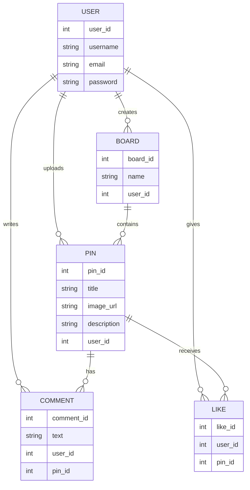

# Pinterest Application – System Design Project

---

## 1. Project Overview

Pinterest is an image-based application that allows users to discover, save, and share visual ideas using images called pins. Users can organize these pins into boards based on their interests, making it easy to collect inspiration for personal, professional, and business-related projects.

---

## 2. User Personas

User personas represent the main types of users who interact with the Pinterest application. These personas help in understanding user needs, behaviors, goals, and frustrations.

---

### USER PERSONA 1 — BROWSING USER

**Name:** Daniel Carter  
**Age:** 26  
**Gender:** Male  
**Location:** Urban area  
**Education:** Bachelor’s Degree  
**Occupation:** Junior Architect  
**Technical Ability:** Intermediate  

**Bio:**  
Daniel is a young professional who uses Pinterest as his primary source of inspiration for architecture, interior design, and modern layouts. He prefers visually rich content and uses Pinterest to collect ideas that help him in both personal and professional projects.

**Goals:**
- discover design inspiration  
- save ideas for future reference  
- organize pins into boards  
- plan home and work projects  

**Motivations:**
- visual learning  
- creativity and aesthetics  
- staying updated with design trends  

**Frustrations:**
- too many saved pins to manage  
- difficulty finding old pins  
- boards becoming cluttered  
- limited search accuracy  

**Behaviors:**
- browses Pinterest daily  
- saves pins frequently  
- rarely uploads content  
- uses boards extensively  

---

### USER PERSONA 2 — CONTENT CREATOR

**Name:** Alex Brown  
**Age:** 30  
**Gender:** Male  
**Location:** New York City  
**Education:** Bachelor’s Degree  
**Occupation:** Graphic Designer  
**Technical Ability:** Advanced  

**Bio:**  
Alex is a creative professional who uses Pinterest to showcase his design work and build a strong online presence. He actively uploads visually appealing pins, creates themed boards, and analyzes engagement to improve content performance.

**Goals:**
- share creative designs  
- grow followers  
- increase engagement on pins  
- build a professional presence  

**Motivations:**
- recognition for creative work  
- audience growth  
- professional branding  

**Frustrations:**
- low engagement on some pins  
- limited analytics insights  
- content visibility issues  

**Behaviors:**
- uploads pins regularly  
- creates curated boards  
- analyzes engagement metrics  
- follows other creators  

---

### USER PERSONA 3 — BUSINESS / BRAND USER

**Name:** Emily Davis  
**Age:** 35  
**Gender:** Female  
**Location:** Metropolitan area  
**Education:** Master’s Degree  
**Occupation:** Marketing Manager  
**Technical Ability:** Advanced  

**Bio:**  
Emily represents a business user who uses Pinterest as a marketing platform. She focuses on promoting products, increasing brand awareness, and driving traffic to company websites through visually appealing pins.

**Goals:**
- promote products visually  
- increase brand reach  
- drive website traffic  
- improve conversions  

**Motivations:**
- business growth  
- customer engagement  
- visual marketing impact  

**Frustrations:**
- low conversion rates  
- limited audience targeting  
- difficulty measuring ROI  

**Behaviors:**
- posts promotional pins  
- creates branded boards  
- tracks performance metrics  
- runs campaigns  

---

## 3. User Stories

User stories describe the core functionalities of the Pinterest application from the users’ perspective.

- As a user, I want to create an account so that I can use Pinterest.
- As a user, I want to log in so that I can access my saved pins and boards.
- As a user, I want to browse pins so that I can discover new ideas.
- As a user, I want to search for pins so that I can find specific content.
- As a user, I want to save pins to boards so that I can organize my ideas.
- As a content creator, I want to upload pins so that I can share my creative work.
- As a content creator, I want to create boards so that I can group my pins.
- As a business user, I want to promote products using pins so that I can reach more users.
- As a user, I want to like and comment on pins so that I can interact with content.

---

## 4. Identified Entities

Based on the user stories, the following entities are required for the Pinterest application:

- User  
- Pin  
- Board  
- Comment  
- Like  

---

## 5. ER Diagram (Mermaid)

The following ER diagram represents the database structure of the Pinterest application.

---
## 6. Tools & Technologies Used

**Mermaid Live Editor:** https://mermaid.live/  
**Mermaid.js:** http://mermaid.js.org/

Mermaid is a text-based diagramming tool that allows the creation of ER diagrams and other visual representations using Markdown-like syntax. It simplifies documentation and avoids the use of heavy diagramming tools.
